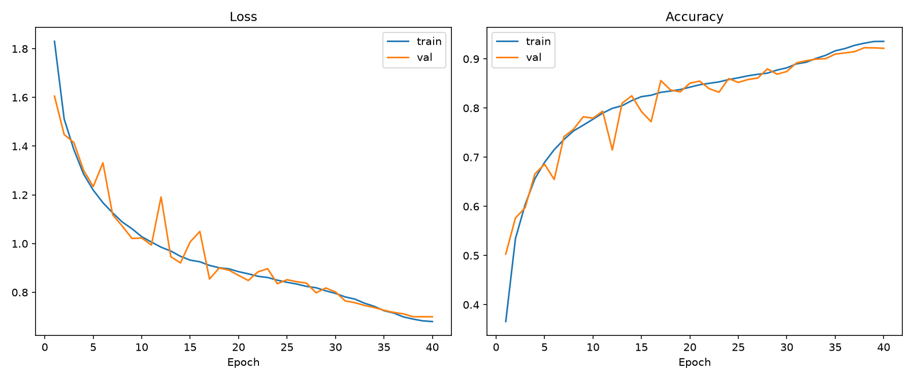
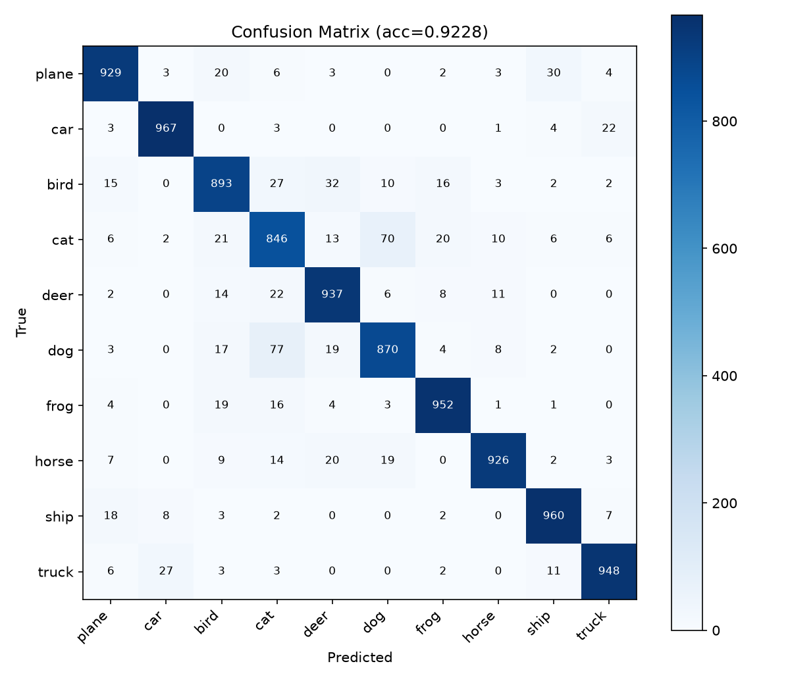

# Performance Results

## Overall test accuracy: 92.28%

## Per-class metrics

```
              precision    recall  f1-score   support

       plane     0.9355    0.9290    0.9323      1000
         car     0.9603    0.9670    0.9636      1000
        bird     0.8939    0.8930    0.8934      1000
         cat     0.8327    0.8460    0.8393      1000
        deer     0.9115    0.9370    0.9241      1000
         dog     0.8896    0.8700    0.8797      1000
        frog     0.9463    0.9520    0.9492      1000
       horse     0.9616    0.9260    0.9435      1000
        ship     0.9430    0.9600    0.9514      1000
       truck     0.9556    0.9480    0.9518      1000

    accuracy                         0.9228     10000
   macro avg     0.9230    0.9228    0.9228     10000
weighted avg     0.9230    0.9228    0.9228     10000
```

Cat and dog are the weakest classes (F1 ~0.84–0.88) — expected, since they're
visually similar at 32x32 resolution. Car, ship, and truck perform best
(F1 > 0.95).

## Training curves



## Confusion matrix



## Real-world inference example

CLI prediction (top-5) on a sample plane image:

```
Predictions:
  plane         96.14%
  bird           0.75%
  ship           0.55%
  cat            0.53%
  deer           0.42%
```

Strong, confident, correct prediction — the model assigns 96%+ confidence to
the correct class with the next-closest classes far behind.
